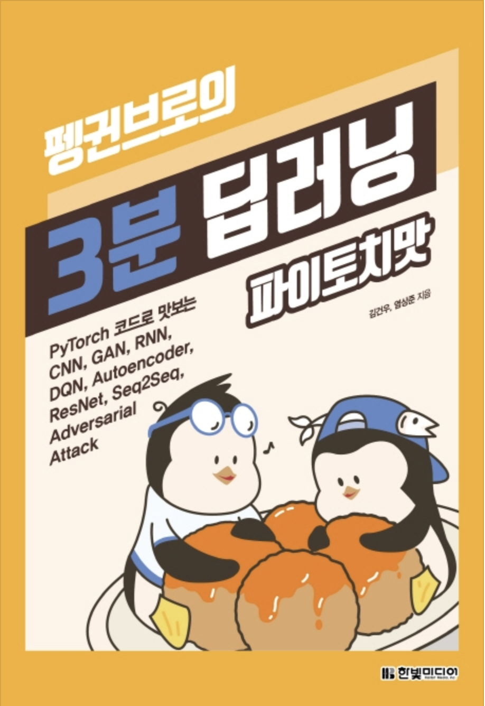

# learning_PyTorch
PyTorch로 딥러닝 배우기

## 목차
1. [1장 딥러닝과 파이토치](https://github.com/201411108/learning_PyTorch/tree/master/src/01)

2. [2장 파이토치 시작하기](https://github.com/201411108/learning_PyTorch/tree/master/src/02)

3. [3장 파이토치로 구현하는 ANN](https://github.com/201411108/learning_PyTorch/tree/master/src/03)

4. [4장 패션 아이템을 구분하는 DNN](https://github.com/201411108/learning_PyTorch/tree/master/src/04)

5. [5장 이미지 처리 능력이 탁월한 CNN](https://github.com/201411108/learning_PyTorch/tree/master/src/05)

6. [6장 사람의 지도 없이 학습하는 오토인코더](https://github.com/201411108/learning_PyTorch/tree/master/src/06)

7. [8장 딥러닝을 해킹하는 적대적 공격](https://github.com/201411108/learning_PyTorch/tree/master/src/08)

## 교재 정보



[펭귄브로의 3분 딥러닝 파이토치맛](https://book.naver.com/bookdb/book_detail.nhn?bid=15559613)

[자료 깃 주소](https://github.com/keon/3-min-pytorch)

## 실습 환경

### 주피터 노트북


### 버전 정보
```
python = 3.7 +
torch = 1.3.0 + cpu
torchvision = 0.4.1 + cpu
```
