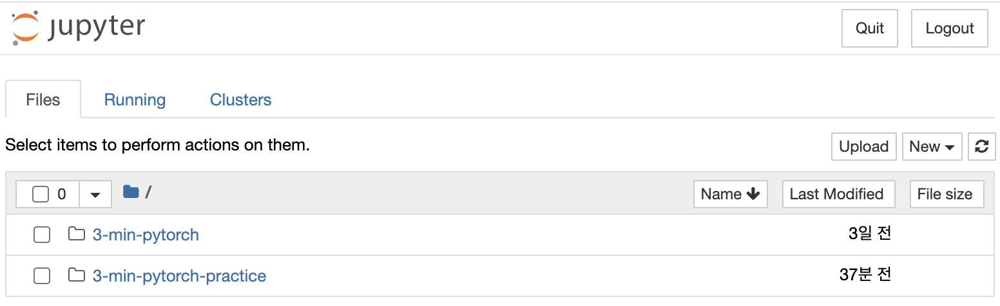

# learning_PyTorch
PyTorch로 딥러닝 배우기

## 목차
[1장 딥러닝과 파이토치](https://github.com/201411108/learning_PyTorch/tree/master/src/01)

## 교재 정보


[펭귄브로의 3분 딥러닝 파이토치맛](https://book.naver.com/bookdb/book_detail.nhn?bid=15559613)

[자료 깃 주소](https://github.com/keon/3-min-pytorch)

## 실습 환경

### 주피터 노트북


### 버전 정보
```
python = 3.7 +
torch = 1.3.0 + cpu
torchvision = 0.4.1 + cpu
```
